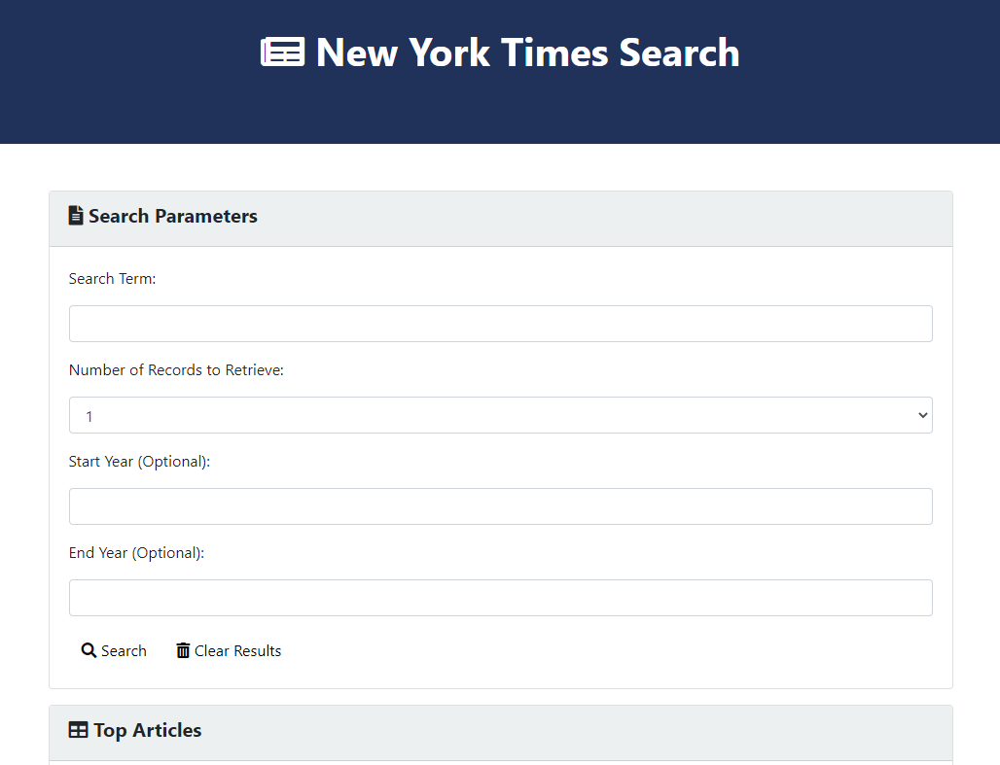

# nytsearch

## Description
A search page for retrieving New York Times article headlines. 

It makes use of the NYT API as well as Bootstrap, jQuery, and Font Awesome.

## Screenshot

## Deployment
This website has been deployed on GitHub as http://malenchite.github.io/nytsearch

## Credits
Bootstrap courtesy of https://getbootstrap.com  
jQuery courtesy of https://jquery.com  
Font Awesome courtesy of https://fontawesome.com  
NYT API courtesy of https://developer.nytimes.com/apis  

Part of a group exercise as part of the UNC Coding Bootcamp, worked on by Chris Risseler, Elena Magay, and Steven Israel.

